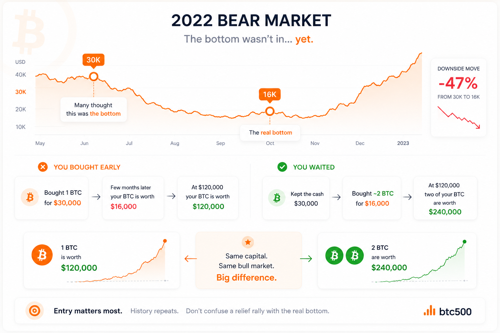
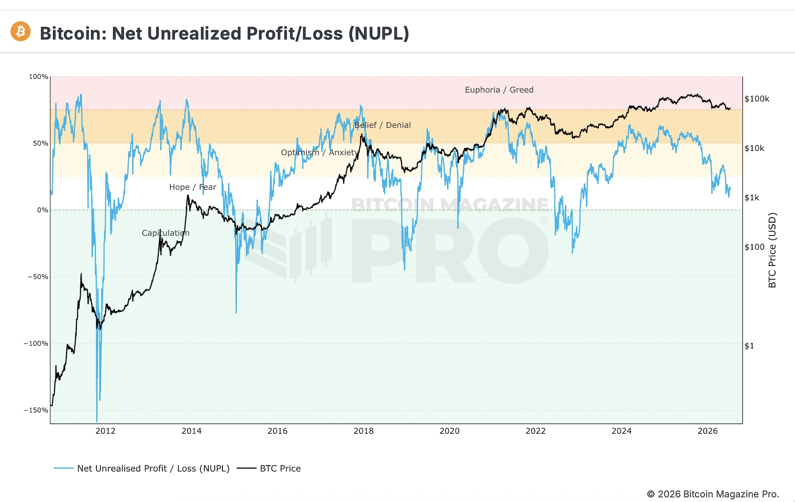

<div align="center">

  

# ₿ BTC 500

### _Buy 500 days before halving. Sell 500 days after. Dead simple._

[](https://btc500.vercel.app)
[](https://github.com/cryptomarkettrack/btc500)
[](#license)
[](#contributing)

  <br />

[**🚀 Live Demo →**](https://btc500.vercel.app)

</div>

---

## 🤔 What is BTC500?

**BTC500** is a beautifully crafted Bitcoin halving countdown and investment strategy platform. It tracks the simplest Bitcoin strategy ever conceived:

> **Buy exactly 500 days before a halving. Sell exactly 500 days after.**

That's it. No complex indicators. No daily trading. Just one clean rule, backed by historical data and wrapped in a gorgeous, real-time dashboard.

<div align="center">

_"In a world of noise, the simplest strategy wins."_

</div>

---

## ✨ Features

<table>
<tr>
<td width="50%" valign="top">

### 🕐 Live Halving Countdown

Real-time countdown to the next Bitcoin halving with **block-height precision**. Watch the progress bar fill as we approach the next epoch — down to the exact block.

### 📊 Investment Simulator

Plug in any dollar amount and see exactly what you'd have earned using the BTC500 strategy across **every past halving cycle** — 2012, 2016, 2020, 2024.

### 📅 Interactive Timeline

A rich, interactive timeline visualizing every Bitcoin halving cycle with buy/sell windows, price data, and return metrics.

</td>
<td width="50%" valign="top">

### 🔥 Liquidation Dashboard

Track real-time Bitcoin liquidation data and understand market dynamics around halving events.

### 📈 Insider Trading Tracker

Monitor insider trading patterns and on-chain signals that matter around halving periods.

### 📰 News & Articles

Curated Bitcoin news feed and in-depth articles about the BTC500 strategy, market analysis, and investment thesis.

</td>
</tr>
</table>

### More

- 🎯 **Shareable Cards** — Generate beautiful social media cards with one click
- 🌙 **Dark Mode** — Full dark mode support
- 📱 **Responsive** — Flawless on mobile, tablet, and desktop
- ⚡ **Real-time Data** — Live prices from Binance, CoinGecko, Coinbase & Kraken
- 🔍 **SEO Optimized** — Schema.org structured data, Open Graph, Twitter Cards
- 🚀 **SSR Powered** — Blazing fast server-side rendering with TanStack Start

---

## 🖼️ Screenshots

<div align="center">

<table>
<tr>
<td align="center"><strong>🏠 Home — Countdown Dashboard</strong></td>
<td align="center"><strong>🧮 Simulator — Returns Calculator</strong></td>
</tr>
<tr>
<td>
  
</td>
<td>
  
</td>
</tr>
</table>

</div>

---

## 🛠️ Tech Stack

<div align="center">

|      Category       |                                   Technology                                    |
| :-----------------: | :-----------------------------------------------------------------------------: |
|    **Framework**    |  [TanStack Start](https://tanstack.com/start) + [React 19](https://react.dev)   |
|     **Routing**     |                 [TanStack Router](https://tanstack.com/router)                  |
|  **Data Fetching**  |               [TanStack React Query](https://tanstack.com/query)                |
|     **Styling**     | [Tailwind CSS v4](https://tailwindcss.com) + [shadcn/ui](https://ui.shadcn.com) |
|    **Animation**    |                 [Framer Motion](https://www.framer.com/motion/)                 |
|     **Charts**      |                        [Recharts](https://recharts.org)                         |
|    **Language**     |                  [TypeScript](https://www.typescriptlang.org)                   |
|   **Deployment**    |                          [Vercel](https://vercel.com)                           |
| **Package Manager** |                              [Bun](https://bun.sh)                              |

</div>

---

## 🚀 Getting Started

### Prerequisites

- [Node.js](https://nodejs.org/) 18+ or [Bun](https://bun.sh/)
- [Git](https://git-scm.com/)

### Installation

```bash
# Clone the repository
git clone https://github.com/cryptomarkettrack/btc500.git

# Navigate into the project
cd btc500

# Install dependencies
bun install
# or
npm install
```

### Development

```bash
# Start the dev server
bun dev
# or
npm run dev
```

Open [http://localhost:3000](http://localhost:3000) to see the app.

### Production Build

```bash
# Build for production
bun run build

# Preview the production build
bun run preview
```

---

## 📁 Project Structure

```
btc500/
├── public/
│   ├── og/                  # Open Graph & social images
│   ├── icons/               # App icons
│   └── favicon.svg          # Favicon
├── src/
│   ├── components/
│   │   ├── articles/        # Article page components
│   │   ├── timeline/        # Timeline widgets & animations
│   │   └── ui/              # shadcn/ui base components
│   ├── hooks/               # Custom React hooks
│   ├── lib/                 # Business logic & utilities
│   │   ├── btc.functions.ts # Bitcoin data fetching
│   │   ├── phase.ts         # Halving cycle calculations
│   │   ├── simulator.functions.ts
│   │   ├── timeline.functions.ts
│   │   └── ...
│   ├── routes/              # TanStack Router file-based routes
│   │   ├── index.tsx        # 🏠 Home — Halving countdown
│   │   ├── simulator.tsx    # 🧮 Investment simulator
│   │   ├── timeline.tsx     # 📅 Interactive timeline
│   │   ├── liquidation.tsx  # 🔥 Liquidation dashboard
│   │   ├── insider-trading.tsx # 📈 Insider trading tracker
│   │   ├── news.tsx         # 📰 Bitcoin news
│   │   ├── articles.tsx     # 📝 Articles hub
│   │   └── embed.tsx        # 🔗 Embeddable widget
│   ├── styles.css           # Global styles & Tailwind theme
│   ├── router.tsx           # Router configuration
│   └── server.ts            # SSR server
├── UI-GUIDELINES.md         # Design system documentation
├── STYLE-GUIDE.md           # Code style guide
└── package.json
```

---

## 🧠 The Strategy

The **BTC500 strategy** is rooted in Bitcoin's most predictable event: **the halving**.

### How it works

```
        ┌─────────────────────────────────────────────────┐
        │                                                 │
   ─────●━━━━━━━━━━━━━━━━━━━━━━━━━━━━━━━━━━━━━━━━━━━━━●─────
        │    BUY                      ₿              SELL   │
        │  (500 days                  │            (500 days│
        │   before)               HALVING          after)  │
        │                                                 │
        └─────────────────────────────────────────────────┘
              ▲                                         ▲
              │                                         │
           BUY NOW                                 SELL HERE
           accumulate                              take profits
```

1. **Buy** BTC exactly **500 days before** each halving
2. **Hold** through the halving event
3. **Sell** exactly **500 days after** the halving
4. **Repeat** every ~4 years

### Historical Performance

|    Cycle     | Buy Date  | Sell Date |     Return     |
| :----------: | :-------: | :-------: | :------------: |
| 2012 Halving | ~Apr 2011 | ~Mar 2013 |   🟢 Massive   |
| 2016 Halving | ~Nov 2014 | ~Sep 2017 | 🟢 Significant |
| 2020 Halving | ~Dec 2018 | ~Sep 2021 | 🟢 Substantial |
| 2024 Halving | ~Jan 2023 | ~Oct 2025 | 🟢 In Progress |

_Past performance does not guarantee future results. This is a backtesting tool, not financial advice._

---

## 🤝 Contributing

Contributions, issues, and feature requests are welcome!

1. **Fork** the repository
2. **Create** your feature branch (`git checkout -b feature/amazing-feature`)
3. **Commit** your changes (`git commit -m 'feat: add amazing feature'`)
4. **Push** to the branch (`git push origin feature/amazing-feature`)
5. **Open** a Pull Request

### Development Guidelines

- Follow the [Style Guide](STYLE-GUIDE.md) for code formatting
- Refer to [UI Guidelines](UI-GUIDELINES.md) for design patterns
- Use [Conventional Commits](https://www.conventionalcommits.org/) for commit messages
- Run `bun run lint` and `bun run format` before pushing

---

## 📄 License

This project is licensed under the **MIT License** — see the [LICENSE](LICENSE) file for details.

---

## 🙏 Acknowledgements

- **[Bitcoin](https://bitcoin.org)** — The reason this all exists
- **[TanStack](https://tanstack.com)** — Incredible React framework ecosystem
- **[shadcn/ui](https://ui.shadcn.com)** — Beautiful, accessible UI components
- **[Vercel](https://vercel.com)** — Seamless deployment
- **[CoinGecko](https://coingecko.com)** — Historical price data
- **[Binance](https://binance.com)**, **[Coinbase](https://coinbase.com)**, **[Kraken](https://kraken.com)** — Live price feeds

---

<div align="center">

**If you found this project useful, please give it a ⭐ — it really helps!**

Made with ❤️ for the Bitcoin community

[**Launch BTC500 →**](https://btc500.vercel.app)

</div>
